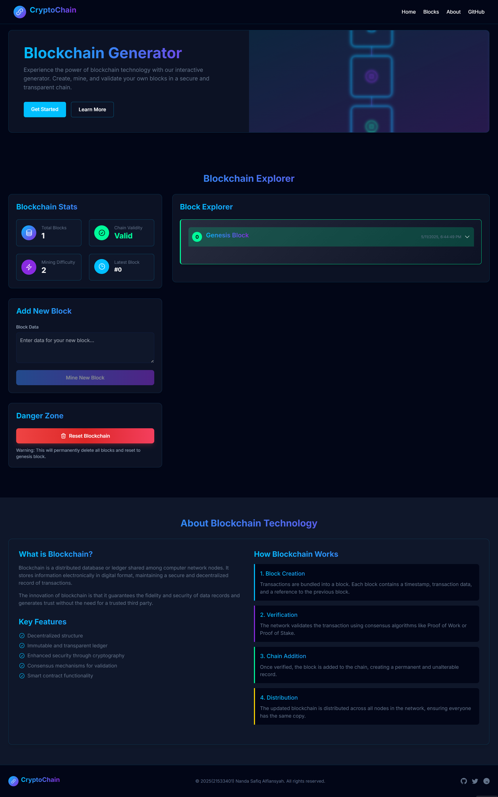

# Crypto Blockchain Generator

  
*A Vue 3 based blockchain simulator for educational purposes*

## 📖 Table of Contents
- [Introduction](#-introduction)
- [Features](#-features)
- [Technologies Used](#-technologies-used)
- [Installation](#-installation)
- [Development](#-development)
- [Building for Production](#-building-for-production)
- [Project Structure](#-project-structure)
- [Contributing](#-contributing)
- [License](#-license)

## 🌟 Introduction

This project is a Vue 3-based educational tool that simulates blockchain technology and cryptocurrency transactions. It's designed to help developers and students understand core blockchain concepts like:

- Cryptographic hashing
- Block creation
- Chain validation
- Proof-of-work simulation
- Wallet transactions

The application uses real cryptographic libraries (CryptoJS) to demonstrate actual blockchain operations while maintaining an easy-to-understand interface.

## 🚀 Features

### Core Functionality
- 🧱 Create customizable blockchain networks
- ⛏️ Mine blocks with adjustable difficulty
- 💰 Generate cryptocurrency wallets
- 🔄 Simulate peer-to-peer transactions
- 🔗 Visualize blockchain structure

### Technical Highlights
- Vue 3 Composition API
- TypeScript support
- Tailwind CSS for styling
- Vue Router for navigation
- Cryptographic operations with CryptoJS
- Vite-powered development environment

## 💻 Technologies Used

### Frontend
| Technology | Purpose |
|------------|---------|
| Vue 3 | Frontend framework |
| TypeScript | Type checking |
| Tailwind CSS | Utility-first CSS |
| Vite | Build tool and dev server |

### Blockchain
| Library | Usage |
|----------|-------|
| CryptoJS | Cryptographic operations |
| crypto-js/sha256 | Hashing algorithm |
| crypto-js/enc-base64 | Encoding |

### Development
| Tool | Purpose |
|------|---------|
| vue-tsc | Type checking |
| autoprefixer | CSS compatibility |
| postcss | CSS processing |

## 🛠️ Installation

### Prerequisites
- Node.js (v18+ recommended)
- npm (v9+ recommended) or yarn
- Git (for version control)

### Setup Instructions

1. **Clone the repository**:
   ```bash
   git clone https://github.com/nandasafiqalfiansyah/crypto-blockchain-generator.git
   cd crypto-blockchain-generator
   ```

2. **Install dependencies**:
   ```bash
   npm install
   # or
   yarn install
   ```

3. **Configure environment** (if needed):
   Create a `.env` file in the root directory for any environment variables.

## 🧑‍💻 Development

### Running the Development Server
```bash
npm run dev
# or
yarn dev
```

This will start the Vite development server at:
```
http://localhost:5173
```

The server features:
- Hot Module Replacement (HMR)
- Fast rebuilds
- TypeScript support
- Vue SFC compilation

### Development Tips
- Use Vue Devtools for debugging
- The project is configured with ESLint for code quality
- Pre-commit hooks can be added for linting

## 🏗️ Building for Production

### Create a Production Build
```bash
npm run build
# or
yarn build
```

This will:
1. Run TypeScript type checking with `vue-tsc`
2. Create an optimized production build with Vite
3. Output files to the `dist/` directory

### Previewing the Production Build
```bash
npm run preview
# or
yarn preview
```

This starts a local server to preview the production build.

## 🤝 Contributing

We welcome contributions! Here's how you can help:

1. **Report bugs**: Open an issue with detailed reproduction steps
2. **Suggest features**: Propose new ideas in discussions
3. **Submit PRs**: Follow these steps:
   - Fork the repository
   - Create a feature branch (`git checkout -b feature/amazing-feature`)
   - Commit your changes (`git commit -m 'Add amazing feature'`)
   - Push to the branch (`git push origin feature/amazing-feature`)
   - Open a Pull Request

### Coding Standards
- Follow Vue style guide
- TypeScript types for all new code
- Descriptive commit messages
- Meaningful component names

## 📜 License

This project is licensed under the MIT License - see the [LICENSE](LICENSE) file for details.

MIT License gives you permission to:
- Use commercially
- Modify
- Distribute
- Place private use
- Include in other projects

The only requirement is to include the original license.

---

**Happy coding!** 🚀 If you have any questions, feel free to open an issue or discussion in the repository.